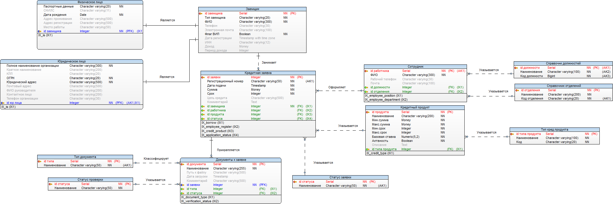
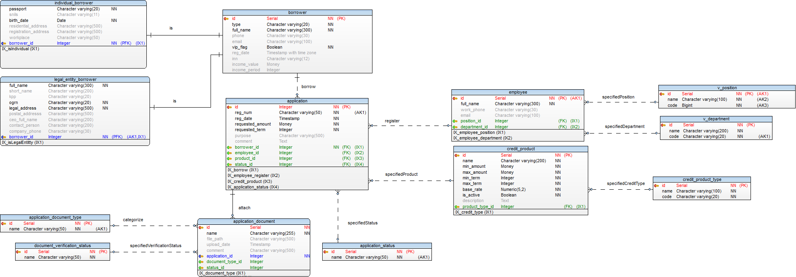
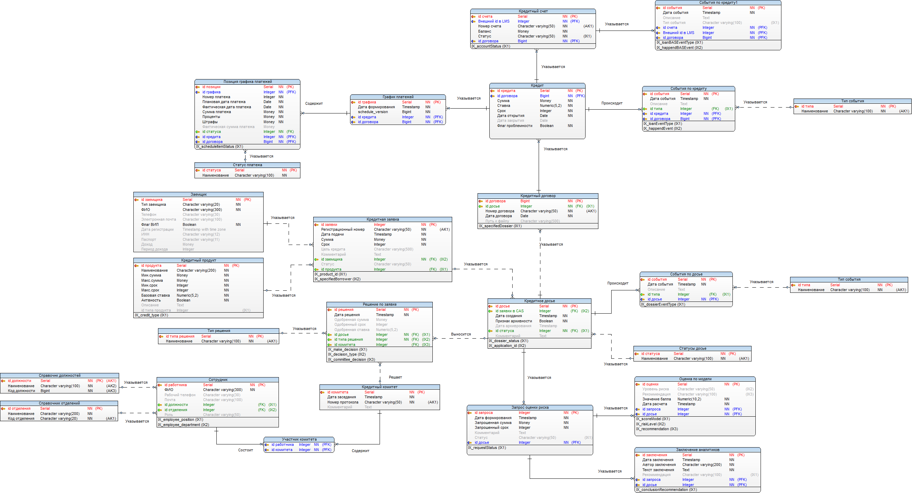
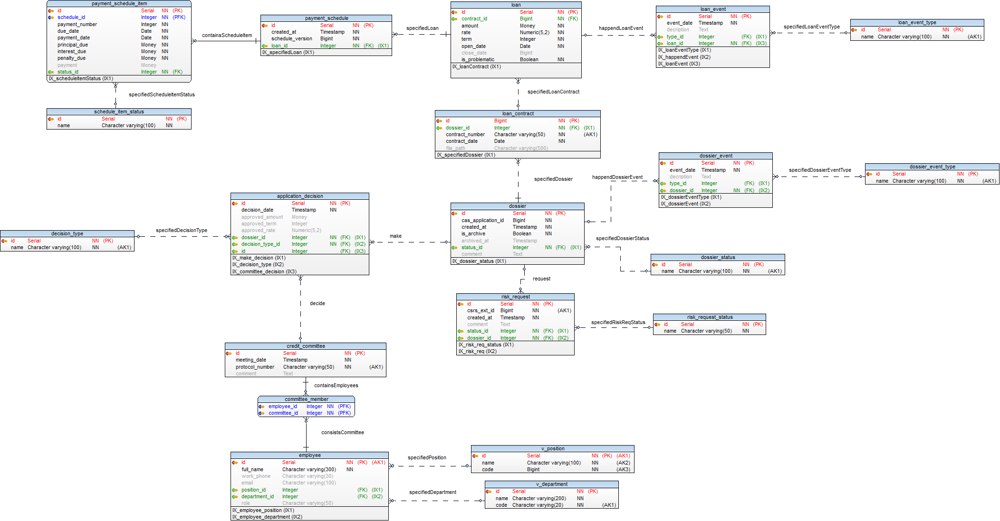
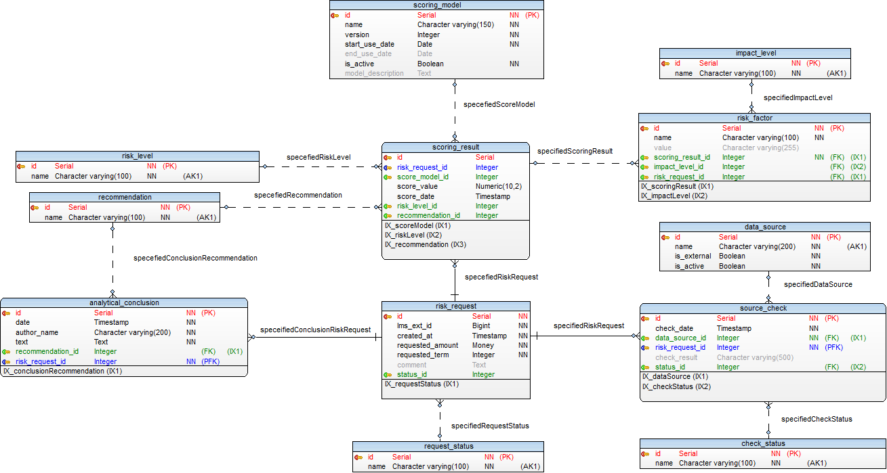
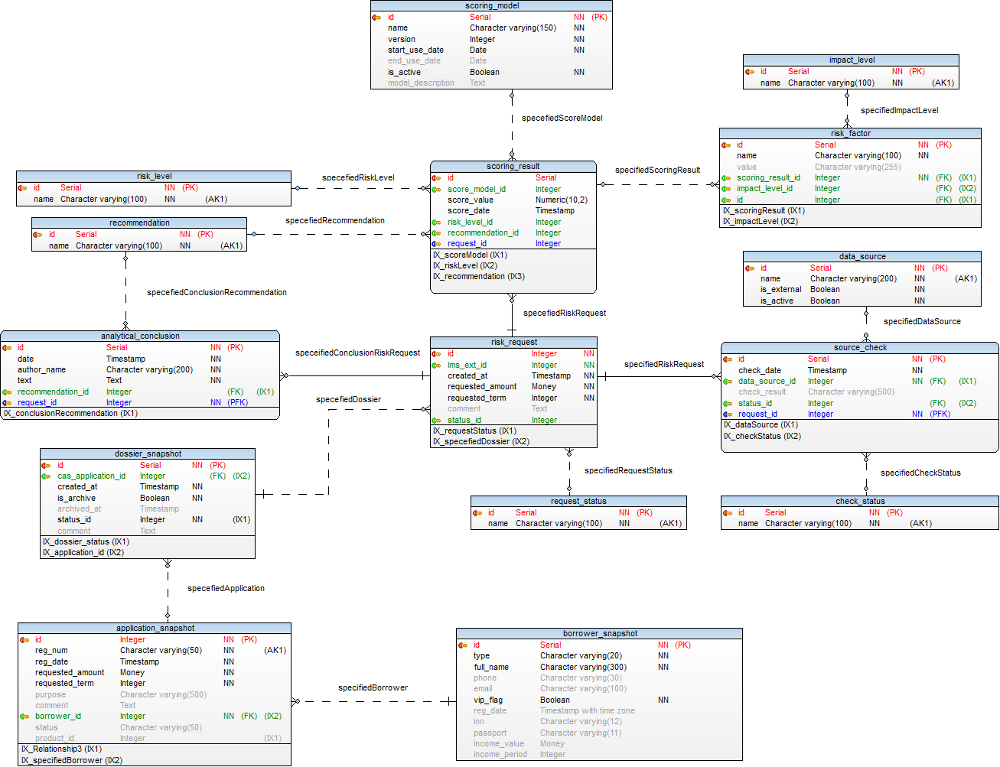
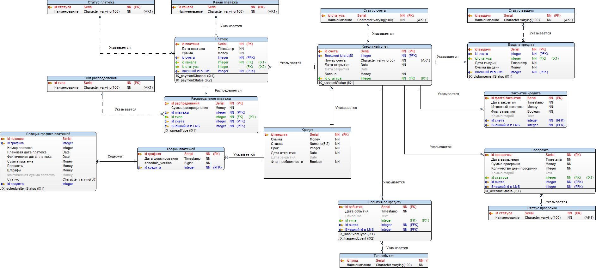
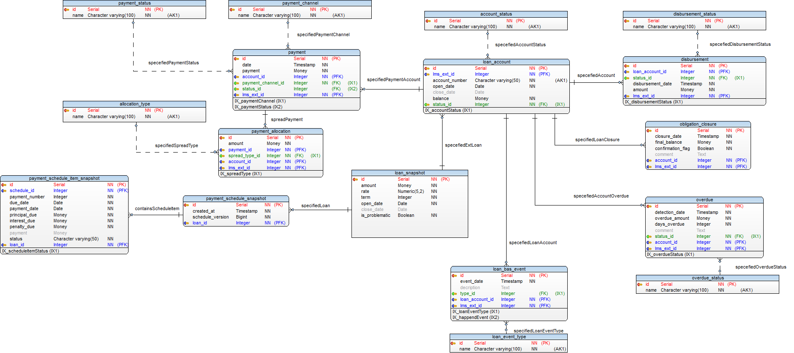

## Модели информационных систем

### CAS — система приема заявок

**Логическая модель:**

**Физическая модель:**

---

### LMS — система управления кредитами

**Логическая модель:**

**Физическая модель:**

---

### CSRS — система скоринга

**Логическая модель:**

**Физическая модель:**

---

### BAS — учет и платежи

**Логическая модель:**

**Физическая модель:**

